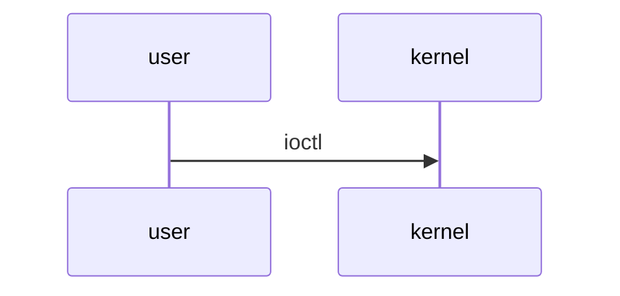

# memory bank

Hugo 로 만들고 GitHub Pages 로 올리는 개인 블로그. <https://squid55.github.io/>

외부 테마 없이 `layouts/` 에 직접 만들었다. 화면은 무채색 — 색상을 쓰지 않고 굵기 · 밑줄 · 선 · 회색 농도로만 구분한다.
사진과 도해만 제 색을 가진다(목록 썸네일은 흑백, 가리키면 색이 돌아온다).

## 로컬에서 보기

```bash
hugo server -D          # http://localhost:1313  (-D: 초안도 보인다)
hugo --gc --minify      # public/ 에 배포용 생성 — CI 가 하는 것과 같다
```

Hugo extended 0.166.0 기준. `main` 에 푸시하면 `.github/workflows/pages.yml` 이 빌드해 올린다.
`draft: true` 인 글은 올라가지 않는다.

> 저장소에 커밋이 하나도 없으면 `enableGitInfo` 때문에 빌드가 실패한다.
> 첫 커밋 전에는 `hugo server -D --enableGitInfo=false` 로 본다.

## 구조

```
content/
├── kernel/                 리눅스 커널
│   ├── v4l2/               V4L2 · 미디어 서브시스템
│   ├── ebpf/               eBPF
│   └── internals/          운영체제 내부 (스케줄러 · 메모리 · 인터럽트 …)
├── embedded/               임베디드 펌웨어 · C/C++ 구조
├── conference/             컨퍼런스 후기 — 글 하나가 폴더 하나 (사진을 같이 넣는다)
│   └── 2026-osskorea/
│       ├── index.md
│       └── photos/*.jpg
├── guides/                 PDF 가이드 — 글 하나가 폴더 하나 (PDF 를 같이 넣는다)
│   └── kernel-guide-01/
│       ├── index.md
│       └── guide.pdf
└── about.md
```

새 주제(예: `kernel/mm/`)는 폴더와 `_index.md` 만 만들면 섹션 페이지에 붙는다.
위쪽 메뉴는 없다. 대문은 분류 없이 날짜순 글 목록만 보여주고, 분류는 글 위의 경로(`리눅스 커널 / V4L2`)로만 드러난다.

## 글 쓰기

```bash
hugo new content kernel/ebpf/verifier.md            # 커널 글
hugo new content embedded/linker-script.md          # 임베디드 글
hugo new content conference/2026-osskorea           # 컨퍼런스 — 폴더째 생성
hugo new content guides/kernel-guide-01             # PDF 가이드 — 폴더째 생성
```

다 쓰면 front matter 의 `draft: true` 를 지운다.

### front matter 에서 쓰는 값

| 키 | 어디서 | 뜻 |
|---|---|---|
| `kernel: "v6.12"` | 커널 글 · 가이드 | 분석한 커널 버전. 제목 아래 표시 |
| `target: "EN683"` | 임베디드 글 | 대상 보드 · SoC |
| `series: ["V4L2 파헤치기"]` | 아무 글 | 연재. 같은 이름끼리 묶어 글 머리에 목록을 보여준다 |
| `weight: 10` | 하위 주제 글 | 순서. 섹션 `_index.md` 에 `order: weight` 가 있으면 날짜 대신 이걸로 정렬 |
| `toc: true` | 아무 글 | 오른쪽 목차 |
| `cover: "photos/x.jpg"` | 컨퍼런스 | 목록 썸네일 · 링크 공유 미리보기 |
| `event: {name, place}` | 컨퍼런스 | 행사 이름 · 장소 |
| `pdf: "guide.pdf"` | 가이드 | 본문 아래 PDF 뷰어 + 내려받기 |

### 본문에서 쓰는 것

````markdown
[다른 글](../ebpf/verifier.md)          파일 경로로 링크 — GitHub 에서도 사이트에서도 동작. 깨지면 빌드 실패

            번들 안 사진. 폭 1400px 로 줄여 내보내고, 누르면 확대

   사진 격자. 캡션은 front matter 의 resources 에서

직접 확인한 것   실측 · warn(주의) · info(참고) · todo(확인하지 못했다)

  본문 중간에 PDF 하나 더

   SVG 를 본문에 직접 심는다 — 다크 모드를 따라간다
                                                        (ipcam-notes 의 docs/fig/*.svg 를 그대로 쓸 수 있다)


````

코드 블록은 언어를 적으면(```` ```c ```` ```` ```bash ````) 굵기·기울임으로 강조되고 복사 버튼이 붙는다.

## 사진

**커밋하기 전에 줄이고 EXIF 를 지운다.**
사이트로 나가는 사진은 Hugo 가 다시 인코딩해서 GPS 가 빠지지만, 공개 저장소의 원본에는 그대로 남는다.

```bash
python3 tools/prep_photos.py ~/Pictures/행사/*.jpg -o content/conference/2026-osskorea/photos
```

긴 변 2500px · JPEG 85 로 줄인다. 폰 사진 한 장이 4MB → 0.5MB 정도가 된다.
GitHub Pages 저장소는 1GB 를 넘기지 않는 편이 좋다.

## PDF

가이드 폴더에 넣고 `pdf:` 에 파일명을 적는다. 100MB 가 넘는 파일은 GitHub 가 받지 않는다.
PC 브라우저는 페이지 안에서 바로 보여주고, 모바일은 대개 내려받기 링크로 연다.

> 이 저장소는 **공개**다. 비공개 저장소(`kernel-guides` 등)에 있던 PDF 를 옮기면 공개된다.

## 파일

| 경로 | 역할 |
|---|---|
| `hugo.toml` | 사이트 설정 · 메뉴 · 대문 구성 |
| `archetypes/` | `hugo new` 가 쓰는 글 틀 |
| `layouts/` | 템플릿. `_shortcodes/` 숏코드, `_markup/` 링크·이미지·제목 렌더링 |
| `assets/css/main.css` | 스타일. 회색 단계는 `:root` 변수(`--text` `--text-2` `--text-3` `--line` …) |
| `assets/css/syntax.css` | 코드 강조. 색 대신 굵기 · 기울임 · 회색으로 직접 작성 |
| `assets/js/site.js` | 검색(`/`) · 테마 전환 · 코드 복사 · 사진 확대 · 목차 강조 |
| `tools/prep_photos.py` | 사진 줄이기 · EXIF 제거 |
