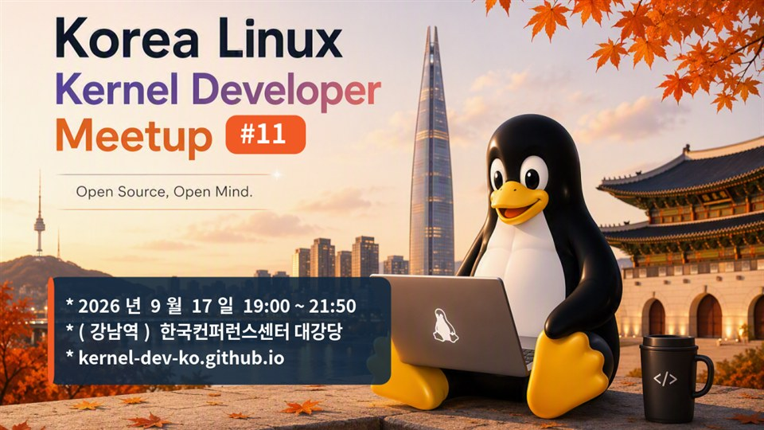

어제(9월 17일) 저녁, 강남역 한국컨퍼런스센터에서 열린 제11회 Korea Linux Kernel Developer Meetup에 갔다.
국내 커널 개발자들의 기술 교류를 위한 자리이고,
LG전자 CTO 소프트웨어센터의 소프트웨어플랫폼연구소가 주관하고 SK하이닉스 등이 후원한다.
들어가니 과자가 담긴 박스를 주셨다. 초코하임, 젤리, 빅파이 같은 것들이 들어 있었다.
당이 부족할 때를 대비해 여러 종류로 담은 모습이 고마웠다.

세션은 여섯 개였다.

| 시간 | 발표 | 발표자 |
|---|---|---|
| 19:05 | Kernel Report | 박병철 (SK하이닉스) |
| 19:25 | Kernel Security Report | 김현우 (독립 취약점 연구자) |
| 19:45 | (라이트닝) 논문으로 본 AI-OS Co-design 트렌드 | 한정연 |
| 20:10 | BPF Memory Allocation | 유형곤 (Meta, 슬랩 할당자 메인테이너) |
| 20:30 | GlusterFS in the Kernel — 서버 수정 없이 FUSE를 커널로 | 김지현 (스토리지 기업) |
| 20:50 | The State of eBPF 2026 | Bill Mulligan (Isovalent) |
| 21:10 | 네트워킹 | |

전체 패치 동향, 보안, 라이트닝, BPF 메모리 관점, 스토리지, 그리고 eBPF 순서였다.
아래는 들으면서 남긴 것과, 끝나고 나눈 대화를 정리한 것이다.

## 커널 리포트 — 1년치 변화

SK하이닉스의 박병철 님이 지난 1년, v6.17부터 v7.2까지의 변화를 골라 소개했다.
연락처로 `max.byungchul.park@sk.com` 을 슬라이드에 적어 두었다.
발표자는 "리눅스는 이미 잘 쓰고 있는데 더 바뀔 게 뭐가 있지"라고 생각하기 쉽지만
여전히 바뀌고 있다는 말로 시작했다.

기억에 남는 것은 **Slub Sheaves**다.

")

슬랩 할당자는 큰 페이지를 받아 잘게 쪼개 작은 객체를 준다.
그런데 CPU 1에서 할당받은 객체가 태스크를 따라 CPU 10으로 옮겨가 거기서 해제되면,
원래 페이지로 돌려주는 과정에서 CPU들이 경쟁하게 된다. 그래서 동기화 비용이 생긴다.
sheaves는 그 정리를 뒤로 미룬다. 해제하는 CPU의 로컬 캐시에 정리하지 않은 채로 넣어 두고,
그 CPU에서 다음 할당 요청이 오면 그대로 준다. 할당과 해제의 동기화를 아예 없앤 것이다.
발표자는 이게 앞으로 대세가 될 거라고 했다.

내가 이 발표에서 이 부분을 제일 열심히 들은 이유는 뒤의 BPF 메모리 발표와 이어지기 때문이다.
결국 둘 다 "커널 안에서 락을 어떻게 피하느냐"는 이야기였다.

나머지 중에 눈에 남은 것들.

- **CPU 보안 완화 옵션 정리(v6.17).** 취약점마다 따로 켜고 끄던 미티게이션을
  user→user, user→kernel, guest→guest, guest→hypervisor, cross-thread처럼 그룹으로 묶었다.
  미티게이션은 대부분 성능을 내주고 보안을 얻는 것이라 다 켤 수는 없는데,
  이제 관리자가 자기 환경에 해당하는 그룹만 고르면 된다.
- **우선순위 역전 대응(v6.17).** PREEMPT_RT 환경이 아닌 보통 서버·데스크톱에서도
  프록시 실행으로 우선순위 역전을 막는 패치가 실험적으로 들어갔다.
- **Live Update Orchestrator(v6.19).** 호스트 커널을 바꿀 때 VM을 전부 내리지 않고,
  잠시 멈췄다가 kexec로 새 커널에 다시 붙인다. 구글이 쓰고 있다고 한다.
- **파일 시스템 에러 보고 인프라(v7.0).** 예전에는 파일이 바뀐 것만 유저 스페이스에 알려 줬는데,
  이제 파일 시스템이 깨진 것도 알려 준다. 깨진 걸 모르고 계속 쓰다 더 크게 번지는 걸 막는다.
- **빌드 타임 락 검증(v7.0).** "이 변수는 이 락을 잡고 접근해야 한다"고 적어 두면
  Clang이 빌드 단계에서 검사한다. 런타임까지 가서 데드락으로 알게 되는 대신에.

")

NTFS는 리눅스에 있긴 했지만 관리되지 않는 상태로 방치돼 있었다고 한다.
이번에 거의 처음부터 다시 구현해서 들어갔고, 한국인 개발자들이 했으며 그분이 그 자리에 있다고 했다.
네트워킹 시간에 찾아가 인사하라는 말도 덧붙였다.

")

스케줄러 쪽은, 예전에는 태스크 하나가 과거에 어느 LLC(라스트 레벨 캐시)에서 돌았는지만 봤다면
이제는 주소 공간을 공유하는 스레드들을 같은 LLC 안에 모은다. 서로 같은 메모리를 볼 가능성이 높으니까.

## 커널 보안 리포트 — 올해 있었던 일

김현우(Hyunwoo Kim) 님이 올해 공개된 주요 커널 취약점을 시간순으로 훑었다.
회사를 나와 독립 취약점 연구자로 활동 중이고, 커널 개발자 모임에서 4년째 발표하고 있다고 했다.
자기소개 슬라이드에 적힌 것만 옮기면 Pwnie Awards 2025·2026 수상, Pwn2Own Berlin 2025·2026의
Red Hat Linux LPE 부문 우승, Google kernelCTF와 kvmCTF 우승이 있다.
이 발표에서 다룬 취약점 중 여러 개가 본인이 직접 찾아 보고하고 패치한 것이다.

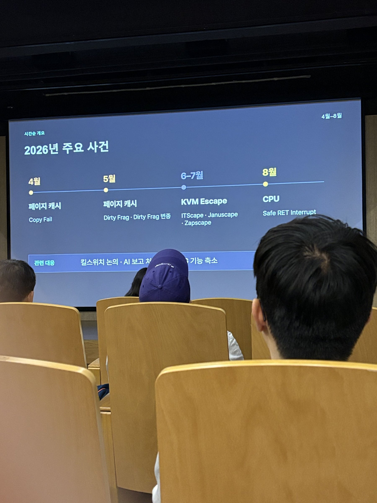

먼저 페이지 캐시 라이트라는 취약점 종류를 설명했다.

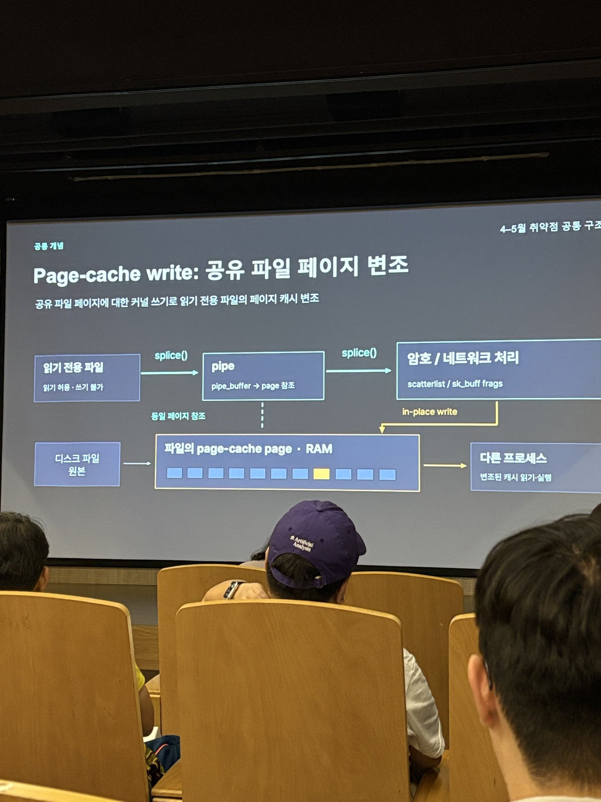

파일을 읽으면 그 내용이 페이지 캐시에 남는다.
`splice()`로 파이프에 넘기면 복사 없이 그 페이지를 참조만 넘긴다. 제로 카피다.
그런데 그 페이지를 넘겨받은 암호 처리나 네트워크 처리 코드가
"이건 내가 고쳐도 되는 버퍼"라고 잘못 판단하면, 파일 권한과 상관없이 페이지 캐시를 직접 고치게 된다.
그다음 그 파일을 읽거나 실행하는 프로세스는 변조된 내용을 본다.

이 유형이 무서운 이유는 따로 있었다. 보통 커널 익스플로잇은 실패하면 커널 패닉이 나서 흔적이 남는데,
이 유형은 성공률이 결정론적이고 실패해도 패닉을 내지 않는다. 그래서 포렌식으로 찾기가 거의 불가능하다.

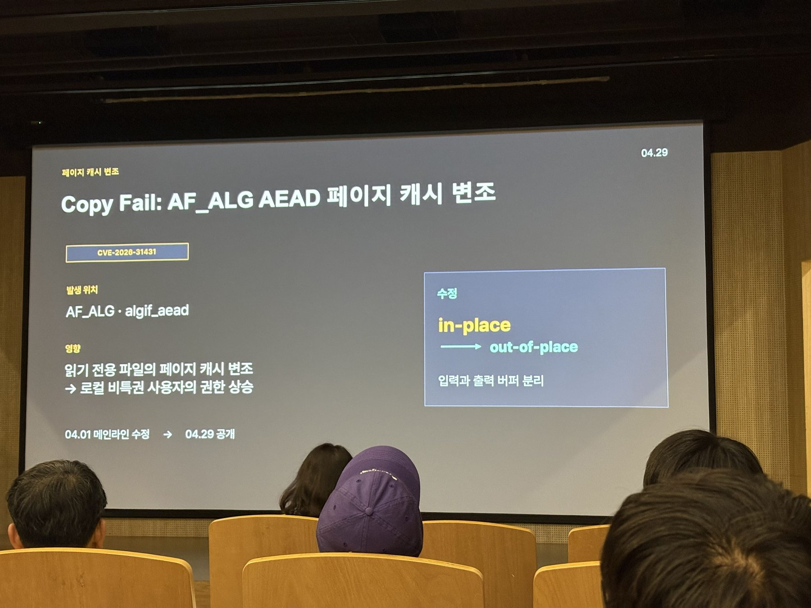

첫 사례인 **CopyFail**은 AF_ALG에서 나왔다.
AF_ALG는 유저 프로그램이 커널의 암호화 기능을 쓰게 해 주는 소켓 인터페이스다.
발표자도 "굳이 왜 커널에서 암호화를 하는지 모르겠지만"이라고 했다.

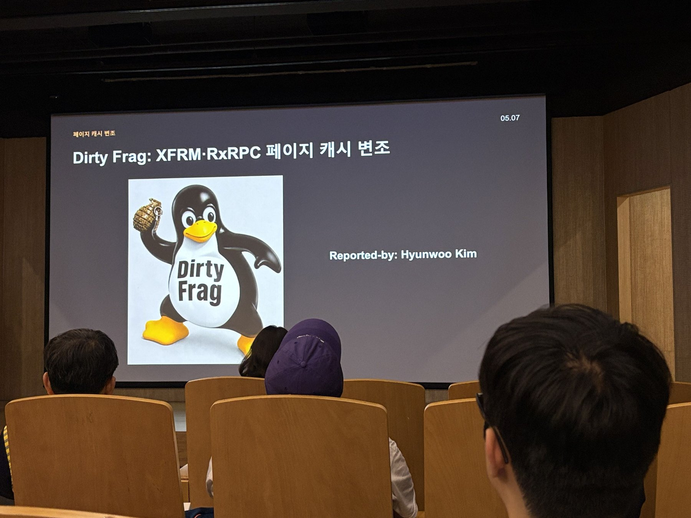

**Dirty Frag**는 발표자가 직접 찾은 것으로, 같은 유형이지만 네트워크 처리 경로에서 발생했다.
XFRM/ESP 쪽과 RxRPC 쪽 두 개다. SKB 프래그먼트를 다루는 곳에서 파일 페이지를 참조한 채로 그것을 고칠 수 있었다.

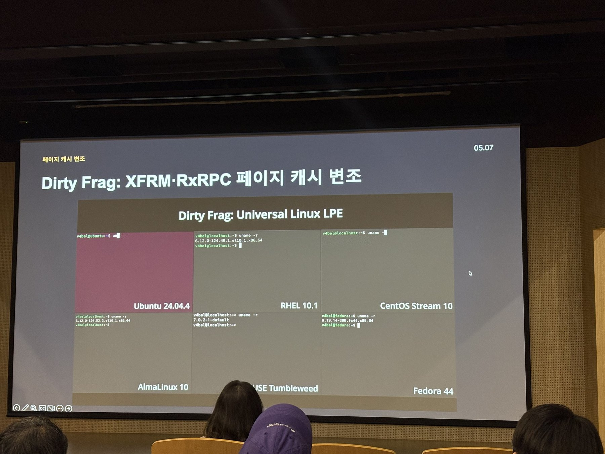

같은 바이너리를 여러 배포판에서 그냥 실행하면 루트가 떴다.

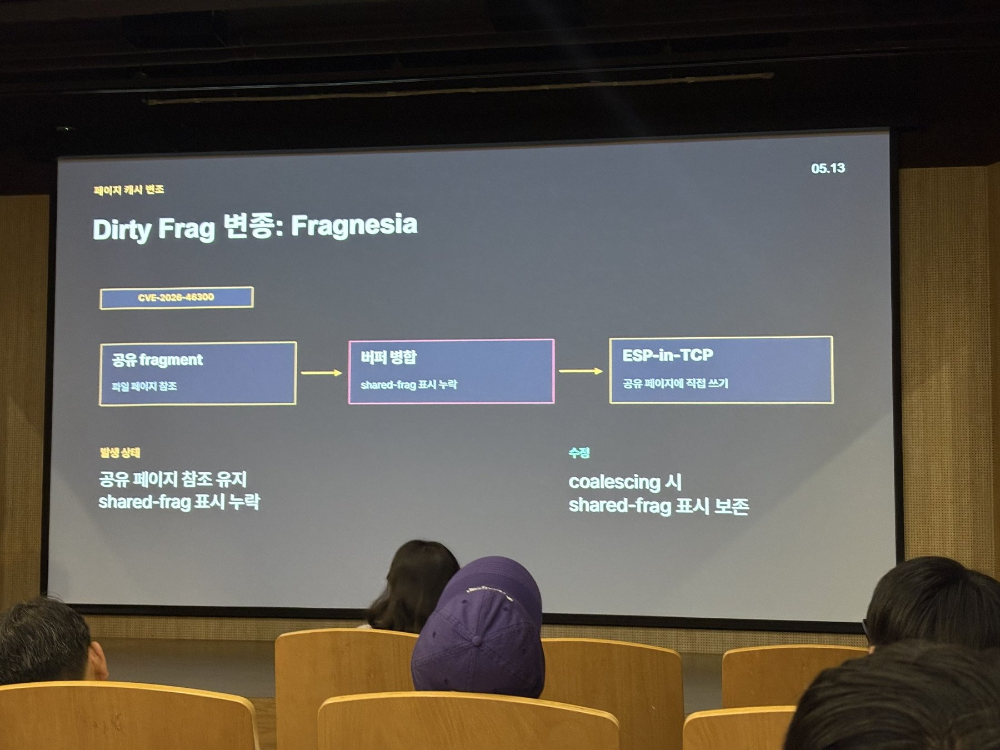

여기서 이야기가 재미있어진다. 발표자가 처음 제안한 패치는 문제가 된 빠른 경로를 아예 없애는 것이었는데,
메인테이너가 성능 저하가 크다며 다른 사람이 낸 shared-frag 기반 패치를 채택했다.
그 뒤로 두 달 동안 그 패치가 누락한 자리에서 변종이 계속 나왔다고 한다.
결국 남은 변종을 모아 한 번에 고친 패치가 머지됐다.
"열흘 동안 잠도 못 자고 고생했다"는 말과, 그 뒤에 메인테이너에게 고맙다는 말을 들었다는 이야기가 같이 나왔다.

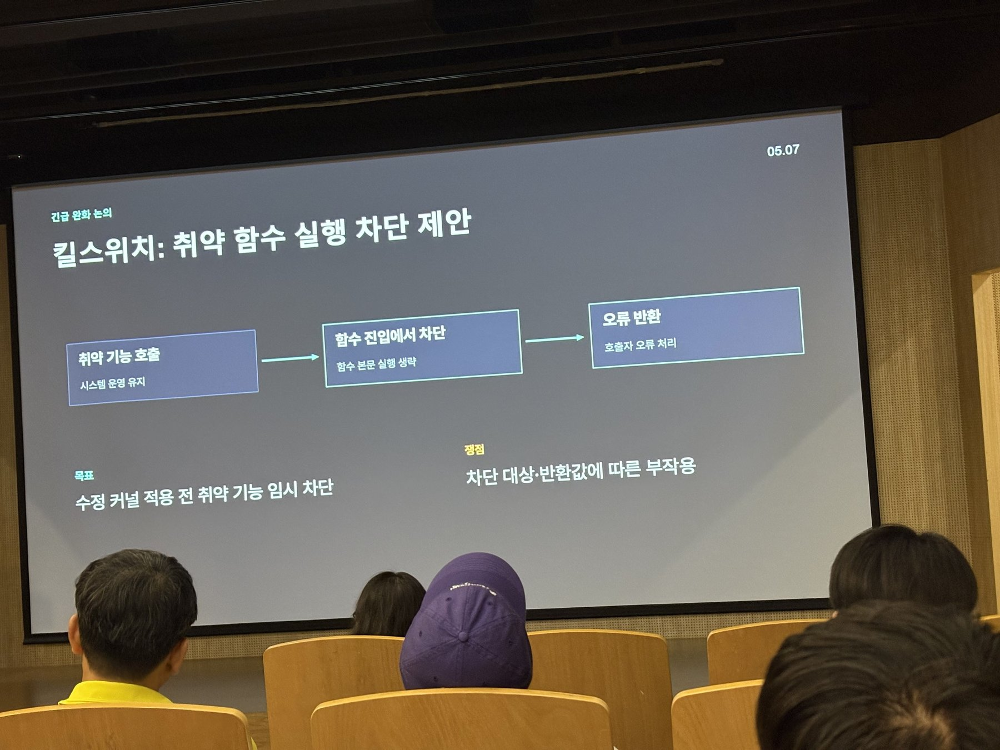

너무 여러 개가 연달아 터지니 **킬 스위치** 같은 극단적인 제안도 나왔다.
관리자가 지정한 커널 함수에 진입하면 본문을 실행하지 않고 그냥 오류를 반환하게 하는 것이다.
패치가 공개돼도 배포판을 거쳐 서버에 적용되기까지 몇 달이 걸리니, 그동안 기능 자체를 막자는 발상이다.
논의만 되고 아직 진전은 없다고 했다.

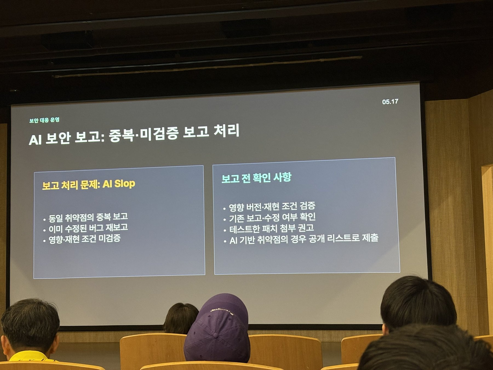

올해는 AI로 인한 변화가 컸다는 이야기도 있었다.
커널 코드를 이해하지 못하는 사람들이 AI를 돌려 만든 보고서와 패치를 무더기로 보내서
보안 팀의 처리가 거의 마비됐고, 그래서 접수 절차 자체가 바뀌었다고 한다.

질의응답에서 "LLM 때문에 공개 지연 관례가 깨지고 있다는데 현업 분위기는 어떠냐"는 질문이 나왔다.
답이 인상적이었다. 예전에는 90일 공개 정책이 있었는데 이제는 "90일이 아니라 90분"이라고 했다.
예전에는 취약점 분석을 할 수 있는 사람이 전 세계에 많지 않아서 엠바고가 지켜졌는데,
이제는 누구나 할 수 있게 돼서 의미가 없어졌다는 것이다. 본인이 설정한 엠바고가 깨진 경험도 직접 겪었다고 했다.

후반부는 KVM 탈출이었다.

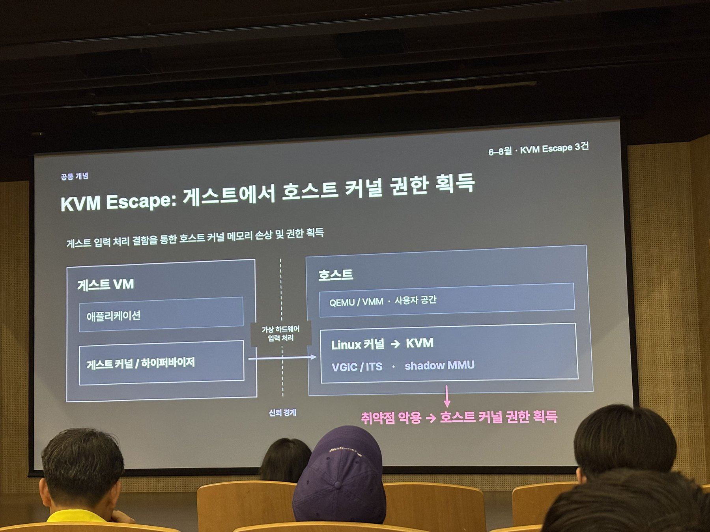

게스트 안에서 루트를 잡아도 원래는 게스트 안에 갇혀 있어야 한다.
그런데 가상 하드웨어 동작을 처리하는 코드 일부는 호스트 커널의 KVM 안에서 돈다.
거기에 취약점이 있으면 게스트가 호스트 커널 메모리를 망가뜨릴 수 있다.

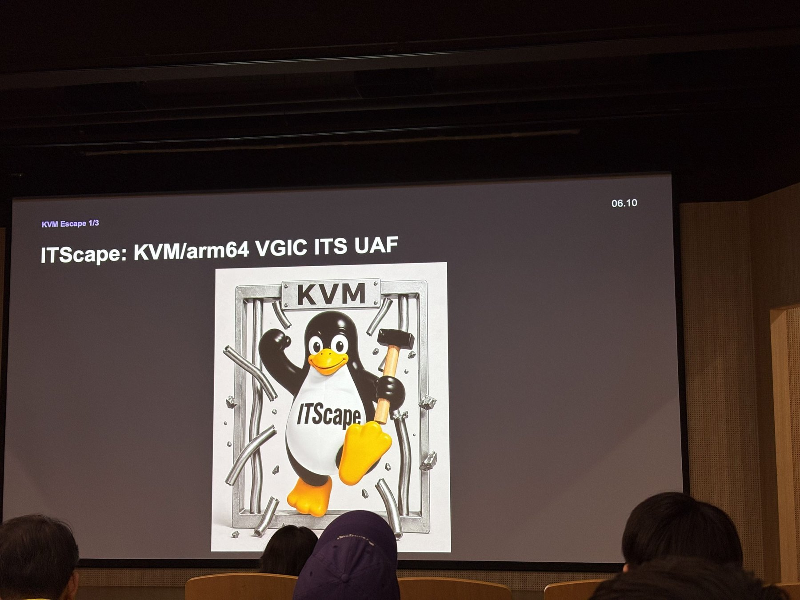

**ITScape**는 arm64 KVM에서 가상 인터럽트를 처리하는 부분의 레이스 컨디션이었다.
ITS 캐시 항목을 무효화할 때 참조 해제가 두 번 일어나 아직 쓰고 있는 객체가 해제됐다.
그 객체가 호스트 커널의 것이라, 게스트가 만든 레이스만으로 호스트를 건드릴 수 있었다.

게스트에서 모듈 하나를 올리면 호스트 전체가 패닉나는 시연 이야기도 나왔다.
클라우드에서 인스턴스 하나 빌려서 PoC를 올리면 그 호스트가 통째로 영향을 받는다는 것이다.
명령 실행까지 가능하지만 그건 공개하지 않았다고 했다.

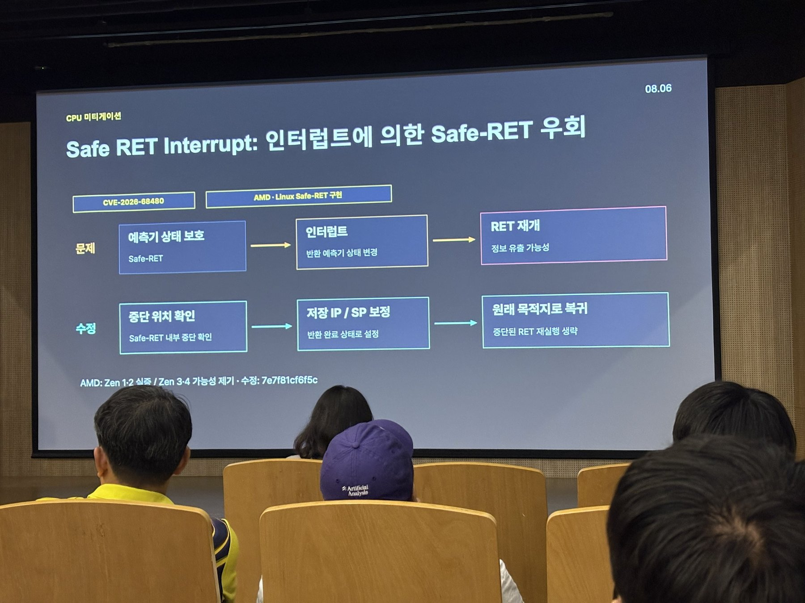

## BPF 메모리 할당 — 결국 락 이야기

 — 슬랩 할당자 메인테이너, Meta")

유형곤(Harry Yoo) 님이 원격으로 발표했다.
리눅스 커널 슬랩 할당자의 메인테이너이고(`MAINTAINERS` 의 SLAB ALLOCATOR 항목에
Vlastimil Babka, Andrew Morton과 함께 올라 있다), 지금은 Meta의 엔지니어다.
발표 시작에 "메타의 의견은 아니고 개인 이야기"라고 밝혔다.
제목은 BPF 메모리 할당이지만, 실제 주제는 **BPF 프로그램이 커널 API를 부를 때 락이 왜 어려워지는가**였다.

정리하면 이렇다.

- 커널의 락은 대부분 "어느 컨텍스트에서 잡히는지"가 미리 정해져 있다.
- 그런데 BPF 프로그램은 어디에 붙을지 알 수 없다. 실행 컨텍스트가 미리 정해지지 않는다.
- 그래서 BPF에서 부르는 커널 API가 아무 스핀락이나 잡으면 데드락이 되기 쉽다.
  페이지 할당자가 스핀락을 쥔 채 지나는 트레이스포인트에 BPF를 붙이고,
  그 BPF가 다시 페이지 할당자를 부르면 그대로 걸린다.

해결 방법은 세 단계로 왔다고 한다.
처음에는 **미리 할당**(pre-allocation)했다. 데드락은 없지만 메모리가 낭비된다.
다음에는 BPF 전용 메모리 할당자를 따로 만들었다. 그러면 커널 할당자의 기능을 하나씩 다시 만들어야 하고,
그쪽이 캐싱한 메모리는 다른 용도로 못 쓴다.
요즘은 커널 할당자 자체가 **기다리지 않는 락**(trylock)을 쓰는 방향이라고 했다.
락을 잡을 수 있는지 시도해 보고, 실패하면 폴백 경로로 간다. 대신 할당 자체가 실패할 수 있다.

BPF 프로그램은 별도의 태스크가 아니라는 설명도 기억에 남는다.
스케줄러가 관리하는 실행 단위가 아니라, 이미 돌고 있는 태스크가 커널 모드에 들어가
특정 지점에 닿았을 때 잠깐 실행됐다 돌아오는 것이다.

앞의 커널 리포트에서 본 sheaves도 결국 같은 문제의 다른 답이었다.
슬랩은 CPU 로컬 캐시로 경쟁을 없앴고, BPF 쪽은 기다리지 않는 락으로 피한다.

## GlusterFS를 커널로

국내 스토리지 기업에서 GlusterFS 기반 솔루션을 개발하는 김지현 님이,
GlusterFS 클라이언트를 FUSE 기반에서 커널 모듈로 옮기는 작업을 이야기했다.
서버 코드는 그대로 두고 클라이언트만 옮기는 것이 목표다.

FUSE는 요청이 커널과 유저 공간을 오가는 비용이 있다.
발표자가 인용한 측정에서는 그 비용이 전체의 상당 부분을 차지했는데,
그게 전부 순수한 FUSE 비용은 아니라는 단서도 같이 붙였다.

흥미로웠던 건 성능 이야기가 아니라 옮기면서 겪은 문제들이었다.

- 문서와 실제 구현이 맞지 않는 곳이 많아서, 결국 코드를 다시 읽고 맞춰야 했다.
- 유저 스페이스에서는 평범하게 짜던 것이 커널 컨텍스트로 들어오면 평범하지 않게 된다. 특히 락.
- DHT 해시 테이블은 브릭이 추가·제거되면 전체가 재계산되는데,
  기존 클라이언트가 쓰던 로직을 완벽히 옮기지 않으면 다른 클라이언트가 쓴 파일을 찾지 못한다.

지금은 기본 I/O가 도는 수준이고, POSIX 호환성 검증이 끝나야 다음으로 간다고 했다.
스토리지 쪽은 내가 잘 모르는 분야인데, "문서를 믿지 말고 구현을 확인해야 한다"는 부분은
V4L2 드라이버를 볼 때와 똑같았다.

## eBPF 2026 — 도구에서 플랫폼으로

마지막은 Isovalent(현재 Cisco)의 Bill Mulligan 님이 직접 와서 한 영어 발표였다.
Cilium과 eBPF 커뮤니티를 맡고 있고 eBPF Foundation 이사회에도 있다.
통역 장비는 없어서 각자 휴대폰으로 들으라는 안내가 있었다.

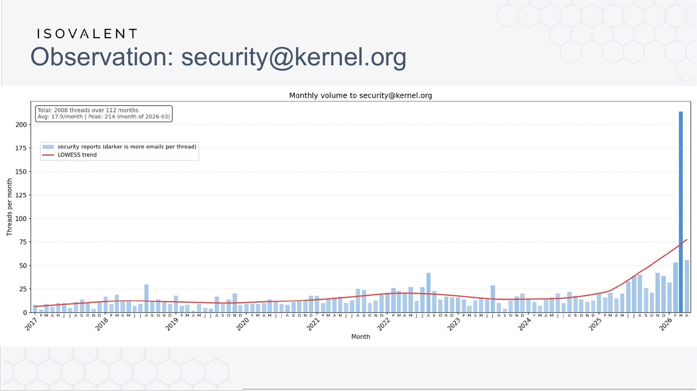

커널 보안 보고가 최근에 급격히 늘어나는 그래프가 나왔다. 앞의 보안 세션에서 들은 이야기와 그대로 겹친다.
AI로 취약점을 찾는 사람이 늘면서 보고가 폭증하고, 패치가 배포판을 거쳐 서버에 닿기까지의 시간이 문제가 된다.
그래서 이 발표에서도 **완화는 에이전트의 속도로 만들어져야 한다**는 주장이 나왔고,
CopyFail 이후 제안된 커널 킬 스위치 패치가 그 예로 인용됐다.
보안 세션에서 본 그 제안이 여기서 다시 나온 것이 재미있었다.

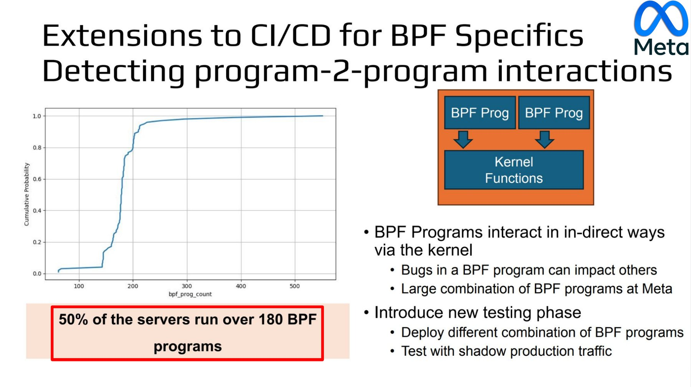

Meta 사례에서는 서버의 절반이 180개 넘는 BPF 프로그램을 돌리고 있고,
BPF 프로그램끼리 커널을 통해 간접적으로 상호작용하면서 생기는 버그를 잡기 위해
CI/CD에 BPF 전용 테스트 단계를 넣는다는 이야기가 나왔다.

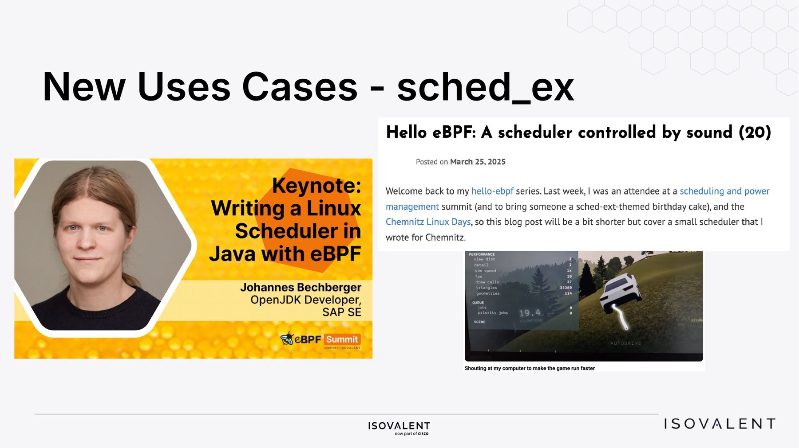

sched_ext로 스케줄러를 BPF로 구현하는 사례, GPU 프로파일링, netkit 같은 새 용도도 소개됐다.
관측 도구에서 시작한 것이 이제 스케줄링 정책 같은 운영체제의 판단까지 올라온 셈이다.

나는 이 발표를 들으면서 이런 생각을 했다.
AI가 발전하면서 취약점도 더 많이 발견되고, AI가 만들어 내는 코드의 버그도 늘어난다.
그걸 잡아내려면 커널을 다시 빌드하지 않고도 안을 들여다보고 막을 수 있는 수단이 필요하다.
eBPF를 더 많이 쓰는 추세인 것은 그래서일까 싶었다.

## 네트워킹 — 피자와 콜라

끝나고 피자와 콜라를 먹으면서 이야기를 나누는 자리가 있었다.
양 옆에 앉은 두 분과 대화하게 됐는데, 한 분은 차량 내 통신 취약점을 분석하고,
다른 한 분은 임베디드 보안 쪽 박사후 연구원이었다.

두 분이 회사의 고민과 방향을 이야기해 주셨는데, 내용을 요약하면 이렇다.
국내 R&D가 차량, 방산, 반도체, 그리고 앞으로의 로보틱스 같은 큰 제조업과 엮여서 흘러가고,
그 안에서 자연스럽게 해당 업계의 보안 취약점, 시스템 아키텍처와 운영체제의 호환성 문제,
통신 부분의 취약점 쪽으로 방향이 잡힌다는 것이었다.
직접 이런 자리에 오지 않으면 모를 이야기였다.

요즘 나는 리눅스 미디어 서브시스템의 vivid를 보면서 이미지 센서 디바이스 드라이버가 어떻게 동작하는지 따라가고 있었다.
그 상태로 이 이야기들을 들으니 연결되는 지점이 보였다.

- eBPF는 모바일 기기 분석에도 쓰인다. 그렇다면 스마트폰 안의 이미지 센서 드라이버와 커널이
  어떻게 맞물려 도는지를 보는 데에도 쓸 수 있지 않을까.
- 이미지 센서만이 아니다. ADAS의 라이다 같은 센서와 MCU, 그리고 커널의 실시간성 —
  지연 문제를 보는 쪽으로도 이어진다.
- 그러면 차량·방산·반도체 제조업과의 연결점이 생긴다.

물론 중간중간 모르는 용어가 많았다. 더 알아야 할 것이 많다는 생각도 같이 들었다.

## 남은 것

- **sheaves를 코드로 확인하기.** 슬라이드로만 봤으니 실제 구현을 봐야 한다.
- **BPF의 trylock 경로.** 할당 실패를 어떻게 처리하는지 궁금하다.
- **페이지 캐시 write 유형.** `splice()`가 페이지 참조를 넘기는 경로를 직접 따라가 보고 싶다.
- **모르는 용어 정리.** 특히 스토리지 쪽은 들으면서 따라가기 벅찼다.

---

슬라이드 사진과 발표 자료 캡처는 각 발표자의 것이다. 잘못 옮긴 내용이 있다면 내 탓이다.
